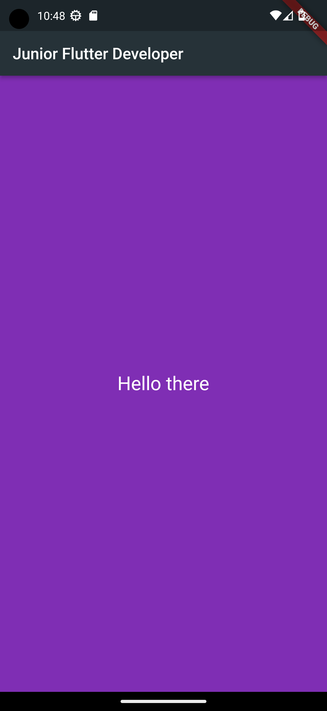
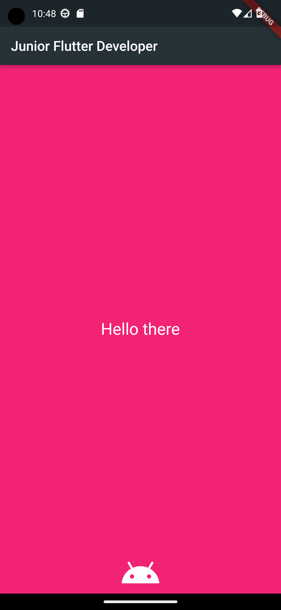
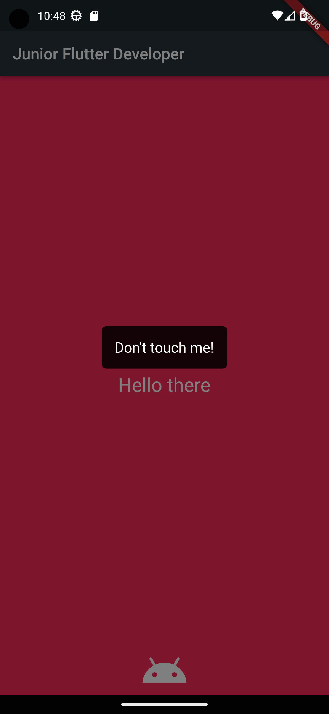

# MyApp Flutter App

Is a simple Flutter application that demonstrates changing background color, showing/hiding an Android icon, and displaying a popup message.

## Features

- Tap on the screen to change the background color.
- An Android icon appears/disappears based on the background color.
- A popup message with a customizable background color is displayed when tapping the Android icon.

## Screenshots

[][][]
